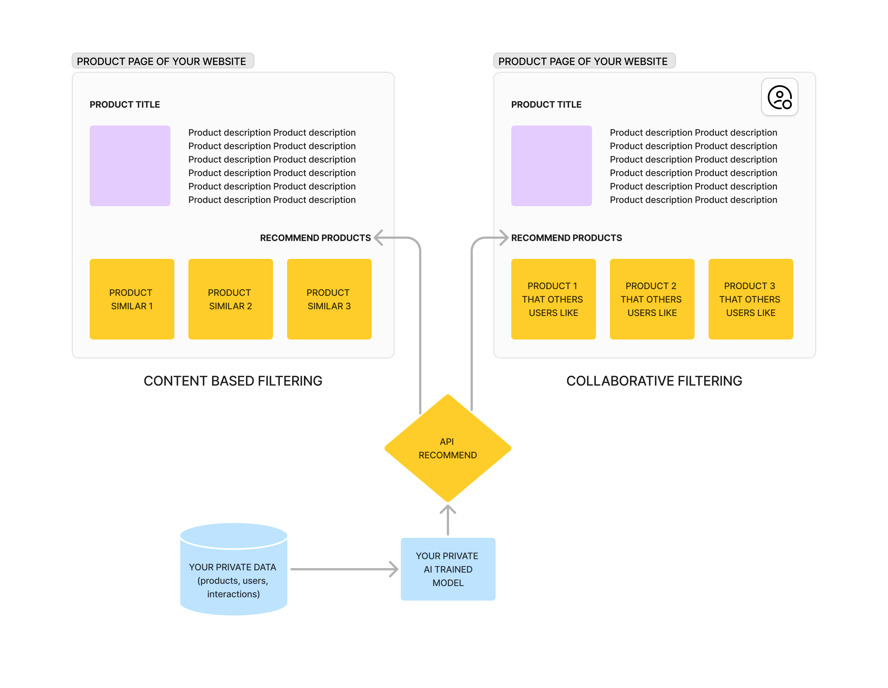
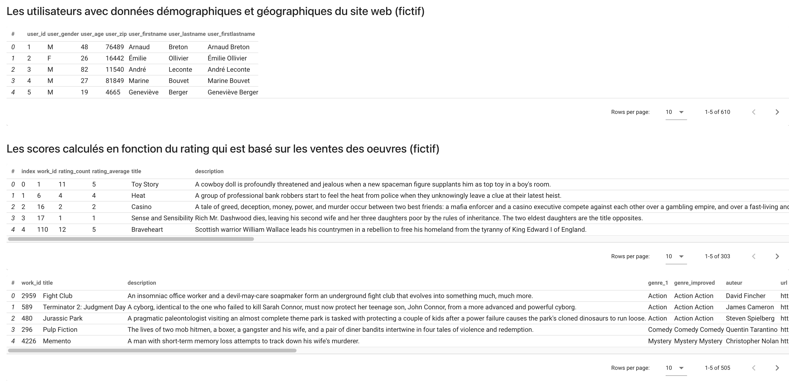
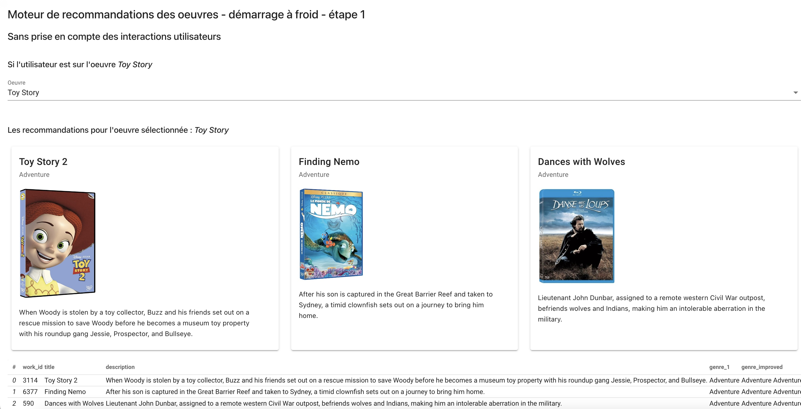
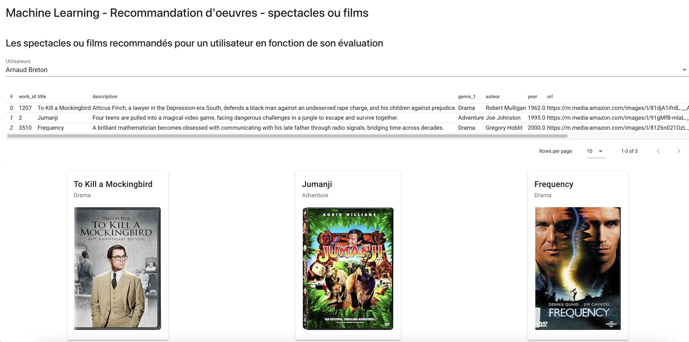

# Products Recommendation System - create your private A.I model and plug your website with the API


## What is this project is for?



Amazon has sales that are 20% to 30% higher thanks to their product recommendation system! 

Why not do it on to your e-commerce website?

You can provide recommended products on a page of your website to your users based of your internal private data (eg: your products, your users ratings, your users purchases or interactions).<br>

It will then display relevant list of products on your website while your user is browsing your Product Page and for none connected users (content-based filtering) and connected users (collaborative filtering).

Whatever CMS (Wordpress, Drupal, Prismic, Shopify...) or custom backend (Laravel, Symfony..) you currently use, if you have data, this project can be adapted and plugged to any source of data (CSV, SQL, MongoDB, Google Big Query...)
and **"your own machine learning model"**

You have now the **API** (fastApi) to list recommended products to your website based on your own Machine Learning model.

## Project Overview

This project aims to build a product recommendation system that predicts relevant products for users based on their 
previous interactions - COLLABORATIVE FILTERING - and without interactions - ITEM BASED FILTERING -. 

The recommendations are served via a REST API, with a Web UI interface to test and visualize results. 
The project leverages various machine learning libraries and frameworks, including PyTorch and Spotlight, to train and deploy 
recommendation models.

## Features

- **Product Recommendations**: Predicts and provides personalized product recommendations for users.
- **REST API**: An API built with FastAPI to serve predictions, allowing easy integration with other applications.
- **Interactive Web UI**: A web interface built with Solara (React-based) for testing and exploring recommendations.

## Technologies Used

- **Python**: Core language for model development, API, and backend logic.
- **PyTorch**: Used as the backbone framework for building and training the recommendation model.
- **Spotlight**: A recommendation library based on PyTorch, used to simplify building and training collaborative filtering models.
- **FastAPI**: A high-performance API framework used to expose the recommendation model for external access.
- **Solara**: A React-based framework for building a Web UI, allowing users to interact with the recommendation model and visualize results.

## How to use the Recommendation System

### Manage Data
- **Exploration**
- **Preparation**
- **Evaluation**



### Recommend Products based on similarities of Products - Content based Filtering
#### 2 methods availables for vectorization of bags of words:
- **CountVectorizer**
- **TfIdfVectorizer**

#### Use of the cosine similarities matrix

```solara run application/website/01-ml-recsys-content-based.py```



### Create the Machine Learning Model - PyTorch Model
```solara run application/website/02-ml-create-model.py```

Path of the model created
```model/movies_users_rating_model.pth```


### Display the recommendation products to the user - Collaborative Filtering
#### Based on the machine learning model - PyTorch Model
```solara run application/website/03-ml-display-rec.py```



### To Come!!

- API for the Rec Sys
- Use of a Vector Database instead of a static Pytorch model